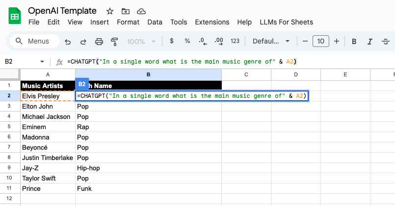
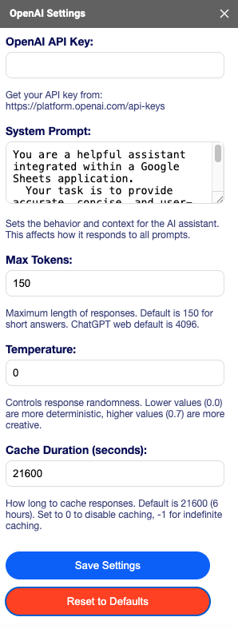
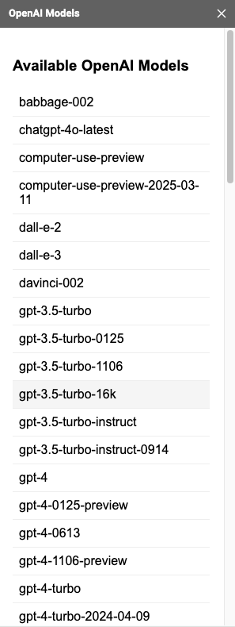
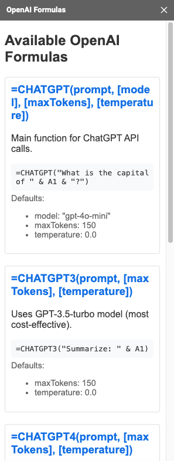

# LLMs for Sheets: AI Google Sheets Formula Add-on

This project provides a set of Google Sheets custom formulas and a sidebar UI for interacting with OpenAI and (soon) other AI platforms. It is designed to be easily extensible, allowing new formulas and providers to be added as the AI ecosystem evolves.

- **Multi-provider ready & extensible:** Planned support for Anthropic, Google Gemini, Azure OpenAI, OpenRouter, Perplexity, and more. Easily add new formulas or providers as the AI ecosystem evolves.
- **Sidebar UI:** Manage API keys, browse formulas, and view available models from an easy-to-use sidebar.  
- **Flexible API key storage:** Store your API key privately (per user) or share it in the sheet/code for team use.
- **Direct OpenAI API access:** Supports any model available in OpenAI's API, including **GPT-3.5-turbo** and **GPT-4o** 🧠
- **Response caching:** Avoid rate limits, reduce costs, and speed up results 🚀
- **Customizable:** Tweak and extend via the Apps Script editor ✍️
- **No third-party servers:** All communication is direct with OpenAI 🔐
- **Free and open-source:** Licensed under MIT 🤝

<p align="center">
  
</p>
<p align="center"><em>Example: Using <code>=CHATGPT()</code> to classify music genres in Google Sheets</em></p>

## Installation

1. Open your Google Sheet.
2. Go to `Extensions` -> `Apps Script`.
3. Copy **all files** from the [`dist`](./dist/) folder into the Apps Scripts editor.
4. Save the script.
5. Open the sidebar (from the LLMs for Sheets menu) to manage your API key and browse available formulas and models.
6. Set your API key either:
    * Using the sidebar (recommended for privacy), **or**
    * With the formula: `=OPENAIKEY("YOUR_API_KEY")` in any cell.
      - Get your API key from OpenAI: https://platform.openai.com/api-keys
      - You can delete this cell to remove the API key from the sheet; it's saved in your personal script properties.
7. Use formulas like `=CHATGPT("Hello, how are you?")` in any cell to generate text.

To compose complex prompts by concatenating multiple cells, you can use the `&` operator. For example: 

```
=CHATGPT("What is the difference between: " & A1 & " and " & A2)
```

## Formulas

* `=OPENAIKEY("YOUR_API_KEY")`: Set your API key.
    * To reset the API key, use an empty string: `=OPENAIKEY("")`.
* `=CHATGPT("prompt", [model], [maxTokens], [temperature])`: Generate text based on the prompt, defaulting to **gpt-4o-mini**.
* `=CHATGPT4("prompt", [maxTokens], [temperature])`: Generate text using **gpt-4o**.
* `=CHATGPT3("prompt", [maxTokens], [temperature])`: Generate text using **gpt-3.5-turbo**.
* `=CHATGPTWEBSEARCH(prompt, [plainText], [maxTokens], [temperature])`: Use GPT-4o with web search capability.  
  - `plainText` (optional): If TRUE, returns plain text without formatting or citations.
* `=CHATGPTSYSTEMPROMPT("prompt")`: Set the system prompt that guides AI behavior.
    * To reset to default system prompt, use an empty string: `=CHATGPTSYSTEMPROMPT("")`.
* `=OPENAIMODELS()`: List available models.

## System Prompt

The system prompt guides how the AI assistant behaves across all formula calls. You can set it in two ways:
1. Using the sidebar (recommended for easy management)
2. Using the formula: `=CHATGPTSYSTEMPROMPT("Your instructions here")`

To reset the system prompt to default behavior, either:
* Clear it in the sidebar, or
* Use `=CHATGPTSYSTEMPROMPT("")` in any cell

## Sidebar

The sidebar is the main way to manage your API key, browse available formulas, and view model information.  
API keys can be stored per-user (private) or in the sheet/code (shared), depending on your needs.

<p align="center">
  
</p>
<p align="center"><em>Sidebar: Manage your API key, system prompt, and default settings</em></p>

<p align="center">
  
</p>
<p align="center"><em>Sidebar: Browse all available OpenAI models</em></p>

<p align="center">
  
</p>
<p align="center"><em>Sidebar: View and copy available OpenAI formulas</em></p>

## Menu Access
After installation, you can access all features through the "LLMs For Sheets" menu:
- `OpenAI Settings`: Configure API key, system prompt, and default settings
- `OpenAI Formulas`: Browse available formulas and examples
- `OpenAI Models`: View all available OpenAI models

## Advanced Settings

### Response Caching
Responses are cached to reduce API costs and improve performance:
- Default cache duration is 6 hours (21600 seconds)
- Cache can be:
  - Disabled by setting duration to `0`
  - Set to indefinite with `-1`
  - Customized to any number of seconds
- Cached responses are unique per combination of prompt, model, max tokens, and temperature
- Cache is stored per user and not shared with other users
- You can modify cache duration in the sidebar settings

### Temperature
Controls the randomness/creativity of responses:
- `0.0` (default): Most deterministic, consistent responses
- `0.7` (ChatGPT web default): More creative, varied responses
- Range is 0.0 to 1.0
- Lower values are better for:
  - Classification tasks
  - Factual queries
  - Data analysis
- Higher values are better for:
  - Creative writing
  - Brainstorming
  - Generating diverse ideas

### Max Tokens
Controls the length of responses:
- `150` (default): Short, concise responses
- `4096` (ChatGPT web default): Long, detailed responses
- Higher values allow for:
  - More detailed explanations
  - Longer text generation
  - But may increase API costs
- Lower values are good for:
  - Quick answers
  - Classification tasks
  - Reducing API costs
- Can be adjusted per formula call or set globally in sidebar

You can modify these settings either:
1. In the sidebar (affects all future calls)
2. Per formula call using optional parameters:
```
=CHATGPT("Your prompt", "gpt-4o", 300, 0.7)
// 300 tokens, 0.7 temperature

=CHATGPT4("Your prompt", 500, 0.2)
// 500 tokens, 0.2 temperature
```

### Function Parameters
- `prompt`: Your input text or cell reference
- `model`: OpenAI model ID (e.g., "gpt-4o-mini", "gpt-4o", "gpt-3.5-turbo")
- `maxTokens`: Maximum length of response (default: 150)
- `temperature`: Response creativity level from 0.0 to 1.0 (default: 0.0)
- `plainText`: For CHATGPTWEBSEARCH, removes formatting and citations (default: false)

### Error Handling
- If you see `#ERROR!`: Check your API key is set correctly
- If you see `EMPTY`: The prompt was empty or invalid
- If you see rate limit errors: Try reducing requests or increasing cache duration
- If response is cut off: Increase `maxTokens` parameter

### Sheet Sharing
When sharing sheets with formulas:
- Each user needs their own API key unless you store it in the sheet
- Cache responses are per-user and not shared
- System prompts are also per-user unless set in the sheet

## Development

### Building from Source
1. Clone the repository:
   ```bash
   git clone https://github.com/reganmcgregor/appscript-llm.git
   cd appscript-llm
   ```

2. Install dependencies:
   ```bash
   pnpm install
   ```

3. Build the project:
   ```bash
   pnpm build
   ```
   This will:
   - Compile TypeScript to JavaScript
   - Copy HTML files to the dist folder
   - Generate `dist/OpenAI.js` and sidebar UI files

4. Copy the generated files from `dist/` to your Google Apps Script editor:
   - `OpenAI.js`: Main script file
   - `OpenAI-Settings.html`: Settings sidebar UI
   - `OpenAI-Models.html`: Models sidebar UI
   - `OpenAI-Formulas.html`: Formulas sidebar UI

### Project Structure
- `src/`: Source TypeScript and HTML files
- `dist/`: Compiled JavaScript and HTML files
- `assets/`: Documentation images
- `package.json`: Project configuration and dependencies

### Development Commands
```bash
pnpm build        # Build the project
pnpm lint         # Run linter
```

---

*For end-user installation instructions, see the [Installation](#installation) section above.*

## Credits

This project was originally inspired by [urvana/appscript-chatgpt](https://github.com/urvana/appscript-chatgpt), but has since been significantly rewritten and extended. See the commit history for details on original contributions.

**Author:** Regan McGregor  
**License:** MIT  
*Originally forked from urvana/appscript-chatgpt by Patricio López Juri. Major rewrites and new features by Regan McGregor.*

## Contributing

Feel free to contribute to this project!  
If you have suggestions, want to request support for a new provider, or have ideas for new formulas, please [open an issue](https://github.com/reganmcgregor/appscript-llm/issues) or a pull request.

### Code

Copy and paste each file into your Apps Script editor with the exact filename:

#### OpenAI.js
```javascript
/**********************************************
 * @author Regan McGregor <https://www.linkedin.com/in/regan-mcgregor/>
 * @license MIT
 * @version 1.0.0
 * @description Google Apps Script for OpenAI API integration in Google Sheets.
 * @see {@link https://github.com/reganmcgregor/appscript-llm}
 */
/** You can change this. */
const SYSTEM_PROMPT = `You are a helpful assistant integrated within a Google Sheets application.
  Your task is to provide accurate, concise, and user-friendly responses to user prompts.
  Explanation is not needed, just provide the best answer you can.`;
/** Prefer short answers. ChatGPT web default is 4096 */
const DEFAULT_MAX_TOKENS = 150;
/** Prefer deterministic and less creative answers. ChatGPT web default is 0.7 */
const DEFAULT_TEMPERATURE = 0.0;
/**
 * Setup how long should responses be cached in seconds. Default is 6 hours.
 * Set to 0, undefined or null to disable caching.
 * Set to -1 to cache indefinitely.
 */
const DEFAULT_CACHE_DURATION = 21600; // 6 hours
/** Helps determinism. */
const DEFAULT_SEED = 0;
/** Value for empty results */
const EMPTY = "EMPTY";
/** Optional: you can hardcode your API key here. Keep in mind it's not secure and other users can see it. */
const OPENAI_API_KEY = "";
/** Private user properties storage keys. This is not the API Key itself. */
const PROPERTY_KEY_OPENAPI = "OPENAI_API_KEY";
const PROPERTY_KEY_SYSTEM_PROMPT = "SYSTEM_PROMPT";
const PROPERTY_KEY_MAX_TOKENS = "DEFAULT_MAX_TOKENS";
const PROPERTY_KEY_TEMPERATURE = "DEFAULT_TEMPERATURE";
const PROPERTY_KEY_CACHE_DURATION = "DEFAULT_CACHE_DURATION";
const MIME_JSON = "application/json";
function REQUEST_COMPLETIONS(apiKey, promptSystem, prompt, model, maxTokens, temperature) {
    var _a, _b;
    // Prepare user prompt
    const promptCleaned = STRING_CLEAN(prompt);
    if (promptCleaned === "") {
        return EMPTY;
    }
    // Use the provided system prompt directly since priority is already handled
    const promptSystemCleaned = STRING_CLEAN(promptSystem);
    console.log('Using System Prompt:', promptSystemCleaned);
    // Create cache key
    const cache = GET_CACHE();
    const cacheKey = HASH_SHA1(promptCleaned, model, maxTokens, temperature);
    // Get current cache duration from properties
    const properties = PropertiesService.getUserProperties();
    const currentCacheDuration = PROPERTY_GET_NUMBER(properties, PROPERTY_KEY_CACHE_DURATION, DEFAULT_CACHE_DURATION || 0);
    // Clear existing cache if duration is 0
    if (currentCacheDuration === 0) {
        cache.remove(cacheKey);
    }
    // Only check cache if duration is positive
    if (currentCacheDuration > 0) {
        const cachedResponse = cache.get(cacheKey);
        if (cachedResponse) {
            console.log('Using cached response');
            return cachedResponse;
        }
    }
    console.log('Making new API request');
    console.log('User Prompt:', promptCleaned);
    if (promptSystemCleaned) {
        console.log('System Prompt:', promptSystemCleaned);
    }
    // Compose messages.
    const messages = [];
    if (promptSystemCleaned) {
        messages.push({ role: "system", content: promptSystemCleaned });
    }
    messages.push({ role: "user", content: promptCleaned });
    /**
     * Unique user ID for the current user (rotates every 30 days).
     * https://developers.google.com/apps-script/reference/base/session?hl=gettemporaryactiveuserkey()
     */
    const user_id = Session.getTemporaryActiveUserKey();
    // Base payload with common parameters
    const basePayload = {
        stream: false,
        model: model,
        max_tokens: maxTokens,
        messages: messages,
    };
    // Add optional parameters based on model
    if (!model.includes("search")) {
        Object.assign(basePayload, {
            temperature: temperature,
            service_tier: "auto",
            n: 1,
            user: user_id,
            seed: DEFAULT_SEED,
        });
    }
    const payload = basePayload;
    const options = {
        method: "post",
        contentType: MIME_JSON,
        headers: {
            Accept: MIME_JSON,
            Authorization: `Bearer ${apiKey}`,
        },
        payload: JSON.stringify(payload),
    };
    const response = UrlFetchApp.fetch("https://api.openai.com/v1/chat/completions", options);
    const json = response.getContentText();
    const data = JSON.parse(json);
    // Log the API response
    const responseContent = (_b = (_a = data["choices"][0]) === null || _a === void 0 ? void 0 : _a["message"]) === null || _b === void 0 ? void 0 : _b["content"];
    console.log('API Response:', responseContent || 'No content');
    // Update caching logic in the response handling
    const choice = data["choices"][0];
    if (choice) {
        const content = (choice["message"]["content"] || "").trim();
        if (content) {
            // Only cache if duration is not 0
            if (currentCacheDuration === -1) {
                console.log('Caching response indefinitely');
                cache.put(cacheKey, content, Number.POSITIVE_INFINITY);
            }
            else if (currentCacheDuration > 0) {
                console.log('Caching response for', currentCacheDuration, 'seconds');
                cache.put(cacheKey, content, currentCacheDuration);
            }
            else {
                console.log('Not caching response (cache duration is 0)');
            }
        }
        return content || EMPTY;
    }
    return EMPTY;
}
/**
 * Custom function to call ChatGPT API.
 * Example: =CHATGPT("What is the average height of " & A1 & "?")
 *
 * @param {string|Array<Array<string>>} prompt The prompt to send to ChatGPT.
 * @param {string} model [OPTIONAL] The model to use (e.g., "gpt-3.5-turbo", "gpt-4"). Default is "gpt-3.5-turbo" which is the most cost-effective.
 * @param {number} maxTokens [OPTIONAL] The maximum number of tokens to return. Default is 150, which is a short response. ChatGPT web default is 4096.
 * @param {number} temperature [OPTIONAL] The randomness of the response. Lower values are more deterministic. Default is 0.0 but ChatGPT web default is 0.7.
 * @return {string|Array<Array<string>>} The response from ChatGPT.
 * @customfunction
 */
function CHATGPT(prompt, model = "gpt-4o-mini", maxTokens = DEFAULT_MAX_TOKENS, temperature = DEFAULT_TEMPERATURE) {
    const apiKey = PROPERTY_API_KEY_GET();
    const systemPrompt = PROPERTY_SYSTEM_PROMPT_GET(); // Get system prompt with proper priority
    if (Array.isArray(prompt)) {
        return prompt.map((row) => row.map((cell) => REQUEST_COMPLETIONS(apiKey, systemPrompt, // Pass the prioritized system prompt
        cell, model, maxTokens, temperature)));
    }
    return REQUEST_COMPLETIONS(apiKey, systemPrompt, // Pass the prioritized system prompt
    prompt, model, maxTokens, temperature);
}
/**
 * Custom function to call ChatGPT-3 API. This is the default and most cost-effective model.
 * Example: =CHATGPT3("Summarize the plot of the movie: " & A1)
 *
 * @param {string|Array<Array<string>>} prompt The prompt to send to ChatGPT. For large arrays, ensure the input size is manageable to avoid performance issues.
 * @param {number} maxTokens [OPTIONAL] The maximum number of tokens to return. Default is 150, which is a short response. ChatGPT web default is 4096.
 * @param {number} temperature [OPTIONAL] The randomness of the response. Lower values are more deterministic. Default is 0.0 but ChatGPT web default is 0.7.
 * @return {string|Array<Array<string>>} The response from ChatGPT
 * @customfunction
 */
function CHATGPT3(prompt, maxTokens = DEFAULT_MAX_TOKENS, temperature = DEFAULT_TEMPERATURE) {
    return CHATGPT(prompt, "gpt-3.5-turbo", maxTokens, temperature);
}
/**
 * Custom function to call ChatGPT-4 API. This is the latest and most powerful model.
 * Example: =CHATGPT4("Categorize the following text into 'positive' or 'negative': " & A1)
 *
 * @param {string|Array<Array<string>>} prompt The prompt to send to ChatGPT
 * @param {number} maxTokens [OPTIONAL] The maximum number of tokens to return. Default is 150, which is a short response. ChatGPT web default is 4096.
 * @param {number} temperature [OPTIONAL] The randomness of the response. Lower values are more deterministic. Default is 0.0 but ChatGPT web default is 0.7.
 * @return {string|Array<Array<string>>} The response from ChatGPT
 * @customfunction
 */
function CHATGPT4(prompt, maxTokens = DEFAULT_MAX_TOKENS, temperature = DEFAULT_TEMPERATURE) {
    return CHATGPT(prompt, "gpt-4o", maxTokens, temperature);
}
/**
 * Custom function to call ChatGPT API with web search capability.
 * Example: =CHATGPTWEBSEARCH(A1)                   -> with formatting (default)
 * Example: =CHATGPTWEBSEARCH(A1, TRUE)            -> plain text only
 * Example: =CHATGPTWEBSEARCH(A1, FALSE, 150, 0.0) -> with all parameters
 *
 * @param {string|Array<Array<string>>} prompt The prompt to send to ChatGPT
 * @param {boolean} plainText [OPTIONAL] Whether to return plain text without formatting or citations. Default is false.
 * @param {number} maxTokens [OPTIONAL] The maximum number of tokens to return. Default is 150, which is a short response.
 * @param {number} temperature [OPTIONAL] The randomness of the response. Lower values are more deterministic. Default is 0.0.
 * @return {string|Array<Array<string>>} The response from ChatGPT
 * @customfunction
 */
function CHATGPTWEBSEARCH(prompt, plainText = false, maxTokens = DEFAULT_MAX_TOKENS, temperature = DEFAULT_TEMPERATURE) {
    const apiKey = PROPERTY_API_KEY_GET();
    const systemPrompt = PROPERTY_SYSTEM_PROMPT_GET();
    // Helper function to process search results
    const processSearchResult = (searchResult) => {
        if (!plainText)
            return searchResult;
        // If plain text is requested, pass through GPT-4 to clean it
        return CHATGPT(`Convert this response to plain text without any formatting, citations, or special characters:\n\n${searchResult}`, "gpt-4o", maxTokens, temperature);
    };
    if (Array.isArray(prompt)) {
        // Handle 2D array (range)
        return prompt.map((row) => row.map((cell) => {
            const searchResult = REQUEST_COMPLETIONS(apiKey, systemPrompt, cell, "gpt-4o-search-preview", maxTokens, temperature);
            return processSearchResult(searchResult);
        }));
    }
    else {
        // Handle single cell
        const searchResult = REQUEST_COMPLETIONS(apiKey, systemPrompt, prompt, "gpt-4o-search-preview", maxTokens, temperature);
        return processSearchResult(searchResult);
    }
}
/**
 * Custom function to set the OpenAI API key. Get yours at: https://platform.openai.com/api-keys
 *
 * @param {string} apiKey The OpenAI API key to save
 * @return {string} Confirmation message
 * @customfunction
 */
function OPENAIKEY(apiKey) {
    PROPERTY_API_KEY_SET(apiKey);
    if (!apiKey) {
        return "🚮 API Key removed from user settings.";
    }
    const options = {
        method: "get",
        contentType: MIME_JSON,
        headers: {
            Accept: MIME_JSON,
            Authorization: `Bearer ${apiKey}`,
        },
    };
    const response = UrlFetchApp.fetch("https://api.openai.com/v1/models", options);
    const json = response.getContentText();
    const data = JSON.parse(json);
    if (!Array.isArray(data["data"]) || data["data"].length === 0) {
        return "❌ API Key is invalid or failed to connect.";
    }
    return "✅ API Key saved successfully.";
}
/**
 * Custom function to set the system prompt.
 * Example: =CHATGPTSYSTEMPROMPT("You are a financial assistant.")
 *
 * @param {string} prompt The system prompt to save
 * @return {string} Confirmation message
 * @customfunction
 */
function CHATGPTSYSTEMPROMPT(prompt) {
    PROPERTY_SYSTEM_PROMPT_SET(prompt);
    if (!prompt) {
        return "🚮 System prompt removed from user settings.";
    }
    return "✅ System prompt saved successfully.";
}
/**
 * Custom function to see available models from OpenAI.
 * Example: =OPENAIMODELS()
 * @return {Array<Array<string>>} The list of available models
 * @customfunction
 */
function OPENAIMODELS() {
    try {
        const apiKey = PROPERTY_API_KEY_GET();
        const options = {
            method: "get",
            contentType: MIME_JSON,
            headers: {
                Accept: MIME_JSON,
                Authorization: `Bearer ${apiKey}`,
            },
        };
        const response = UrlFetchApp.fetch("https://api.openai.com/v1/models", options);
        const json = response.getContentText();
        const data = JSON.parse(json);
        if (!Array.isArray(data["data"]) || data["data"].length === 0) {
            return [["🌵 No models available"]];
        }
        // Sort models alphabetically for better display
        return data["data"]
            .sort((a, b) => a.id.localeCompare(b.id))
            .map((model) => [model["id"]]);
    }
    catch (error) {
        return [[`Error: ${error instanceof Error ? error.message : String(error)}`]];
    }
}
/**
 * Shows a sidebar in the Google Sheets UI with environment variable settings.
 * This function creates a custom UI element that lets users configure API settings.
 */
function showSettingsSidebar() {
    const html = HtmlService.createHtmlOutputFromFile('OpenAI-Settings')
        .setTitle('OpenAI Settings')
        .setWidth(400);
    SpreadsheetApp.getUi().showSidebar(html);
}
/**
 * Shows a sidebar in the Google Sheets UI with formulas.
 * This function creates a custom UI element that lets users see available formulas.
 */
function showFormulaSidebar() {
    const html = HtmlService.createHtmlOutputFromFile('OpenAI-Formulas')
        .setTitle('OpenAI Formulas')
        .setWidth(400);
    SpreadsheetApp.getUi().showSidebar(html);
}
/**
 * Shows a sidebar in the Google Sheets UI with available models.
 * This function creates a custom UI element that lets users see available models.
 */
function showModelsSidebar() {
    const html = HtmlService.createHtmlOutputFromFile('OpenAI-Models')
        .setTitle('OpenAI Models')
        .setWidth(400);
    SpreadsheetApp.getUi().showSidebar(html);
}
/**
 * Updates the environment variables with values from the settings form.
 * This function is called from the sidebar UI.
 */
function updateSettings(settings) {
    const properties = PropertiesService.getUserProperties();
    properties.setProperties({
        [PROPERTY_KEY_SYSTEM_PROMPT]: settings.systemPrompt,
        [PROPERTY_KEY_MAX_TOKENS]: settings.maxTokens.toString(),
        [PROPERTY_KEY_TEMPERATURE]: settings.temperature.toString(),
        [PROPERTY_KEY_CACHE_DURATION]: settings.cacheDuration.toString(),
        [PROPERTY_KEY_OPENAPI]: settings.apiKey,
    });
    return { status: 'success', message: 'Settings updated successfully' };
}
/**
 * Gets the current environment variable settings.
 * This function is called from the sidebar UI.
 */
function getSettings() {
    const properties = PropertiesService.getUserProperties();
    return {
        systemPrompt: properties.getProperty(PROPERTY_KEY_SYSTEM_PROMPT) || SYSTEM_PROMPT,
        maxTokens: PROPERTY_GET_NUMBER(properties, PROPERTY_KEY_MAX_TOKENS, DEFAULT_MAX_TOKENS),
        temperature: PROPERTY_GET_NUMBER(properties, PROPERTY_KEY_TEMPERATURE, DEFAULT_TEMPERATURE),
        cacheDuration: PROPERTY_GET_NUMBER(properties, PROPERTY_KEY_CACHE_DURATION, ENSURE_NUMBER(DEFAULT_CACHE_DURATION, 21600)),
        apiKey: properties.getProperty(PROPERTY_KEY_OPENAPI) || OPENAI_API_KEY,
    };
}
/**
 * Resets all environment variable settings to their default values.
 */
function resetSettings() {
    PropertiesService.getUserProperties().deleteAllProperties();
    return {
        systemPrompt: SYSTEM_PROMPT,
        maxTokens: DEFAULT_MAX_TOKENS,
        temperature: DEFAULT_TEMPERATURE,
        cacheDuration: DEFAULT_CACHE_DURATION,
        apiKey: ''
    };
}
/**
 * Creates a custom menu in Google Sheets when the spreadsheet opens.
 */
function onOpen() {
    SpreadsheetApp.getUi()
        .createMenu('LLMs For Sheets')
        .addItem('OpenAI Settings', 'showSettingsSidebar')
        .addItem('OpenAI Formulas', 'showFormulaSidebar')
        .addItem('OpenAI Models', 'showModelsSidebar')
        .addToUi();
}
function PROPERTY_API_KEY_SET(apiKey) {
    const properties = PropertiesService.getUserProperties();
    if (apiKey === null || apiKey === undefined) {
        properties.deleteProperty(PROPERTY_KEY_OPENAPI);
    }
    else {
        properties.setProperty(PROPERTY_KEY_OPENAPI, apiKey);
    }
}
function PROPERTY_API_KEY_GET() {
    const properties = PropertiesService.getUserProperties();
    const apiKey = properties.getProperty(PROPERTY_KEY_OPENAPI) || OPENAI_API_KEY;
    if (!apiKey) {
        throw new Error('Use =OPENAIKEY("YOUR_API_KEY") first. Get it from https://platform.openai.com/api-keys');
    }
    return apiKey;
}
function PROPERTY_SYSTEM_PROMPT_SET(prompt) {
    const properties = PropertiesService.getUserProperties();
    if (prompt === null || prompt === undefined) {
        properties.deleteProperty(PROPERTY_KEY_SYSTEM_PROMPT);
    }
    else {
        properties.setProperty(PROPERTY_KEY_SYSTEM_PROMPT, prompt);
    }
}
function PROPERTY_SYSTEM_PROMPT_GET() {
    const properties = PropertiesService.getUserProperties();
    // Check for CHATGPTSYSTEMPROMPT value first
    const functionPrompt = properties.getProperty(PROPERTY_KEY_SYSTEM_PROMPT);
    if (functionPrompt) {
        return functionPrompt;
    }
    // Fall back to sidebar value
    const sidebarPrompt = properties.getProperty(PROPERTY_KEY_SYSTEM_PROMPT);
    if (sidebarPrompt) {
        return sidebarPrompt;
    }
    // Finally fall back to default
    return SYSTEM_PROMPT;
}
function STRING_CLEAN(value) {
    if (value === undefined || value === null) {
        return "";
    }
    if (typeof value === "number") {
        return value.toString();
    }
    return String(value).trim();
}
function HASH(algorithm, ...args) {
    const input = args.join("");
    const hash = Utilities.computeDigest(algorithm, input)
        .map((byte) => {
        const v = (byte & 0xff).toString(16);
        return v.length === 1 ? `0${v}` : v;
    })
        .join("");
    return hash;
}
function HASH_SHA1(...args) {
    return HASH(Utilities.DigestAlgorithm.SHA_1, ...args);
}
function GET_CACHE() {
    // TODO: not sure which one is the best cache to use.
    return (CacheService.getDocumentCache() ||
        CacheService.getScriptCache() ||
        CacheService.getUserCache());
}
function PROPERTY_GET_NUMBER(properties, key, defaultValue) {
    const value = properties.getProperty(key);
    if (!value)
        return defaultValue;
    const parsed = Number(value);
    return isNaN(parsed) ? defaultValue : parsed;
}
function ENSURE_NUMBER(value, fallback) {
    if (value === null || value === undefined)
        return fallback;
    return value;
}

```

#### OpenAI-Settings.html
```html
<!DOCTYPE html>
<html>
  <head>
    <base target="_top">
    <style>
      .form-group {
        margin-bottom: 15px;
      }
      .field-description {
        font-size: 12px;
        color: #384179;
        margin-top: 4px;
        margin-bottom: 8px;
        font-family: manrope-bold, "Helvetica Neue", Helvetica, Arial, "Lucida Grande", sans-serif;
      }
      label {
        display: block;
        margin-bottom: 5px;
        font-weight: bold;
        font-size: 14px;
        font-family: manrope-bold, "Helvetica Neue", Helvetica, Arial, "Lucida Grande", sans-serif;
        color: #061257;
      }
      input {
        width: 90%;
        padding: 8px;
        margin-bottom: 10px;
        border: 1px solid #ddd;
        border-radius: 8px;
      }
      textarea {
        width: 90%;
        padding: 8px;
        margin-bottom: 10px;
        border: 1px solid #ddd;
        border-radius: 8px;
        resize: vertical;  /* Only allows vertical resizing */
      }
      button {
        background-color: #0A65FC;
        color: white;
        padding: 10px 15px;
        border: none;
        border-radius: 160px;
        cursor: pointer;
        width: 90%;
        margin-top: 10px;
      }
      button:hover {
        background-color: #3B84FD;
      }
      .btn-danger {
        background-color: #FF4401;
      }
      .btn-danger:hover {
        background-color: #FF4401;
      }
      .message {
        margin-top: 10px;
        padding: 10px;
        border-radius: 20px;
      }
      .success {
        background-color: #d4edda;
        color: #155724;
      }
      .error {
        background-color: #ff4401;
        color: #fff;
      }
    </style>
  </head>
  <body>
    <div class="container">
      <form id="settingsForm">
        <div class="form-group">
          <label for="apiKey">OpenAI API Key:</label>
          <input type="password" id="apiKey" name="apiKey" class="form-control">
          <div class="field-description">
            Get your API key from: https://platform.openai.com/api-keys
          </div>
        </div>

        <div class="form-group">
          <label for="systemPrompt">System Prompt:</label>
          <textarea id="systemPrompt" name="systemPrompt" class="form-control" rows="4"></textarea>
          <div class="field-description">
            Sets the behavior and context for the AI assistant. This affects how it responds to all prompts.
          </div>
        </div>

        <div class="form-group">
          <label for="maxTokens">Max Tokens:</label>
          <input type="number" id="maxTokens" name="maxTokens" class="form-control">
          <div class="field-description">
            Maximum length of responses. Default is 150 for short answers. ChatGPT web default is 4096.
          </div>
        </div>

        <div class="form-group">
          <label for="temperature">Temperature:</label>
          <input type="number" id="temperature" name="temperature" step="0.1" class="form-control">
          <div class="field-description">
            Controls response randomness. Lower values (0.0) are more deterministic, higher values (0.7) are more creative.
          </div>
        </div>

        <div class="form-group">
          <label for="cacheDuration">Cache Duration (seconds):</label>
          <input type="number" id="cacheDuration" name="cacheDuration" class="form-control">
          <div class="field-description">
            How long to cache responses. Default is 21600 (6 hours). Set to 0 to disable caching, -1 for indefinite caching.
          </div>
        </div>

        <div class="form-group">
          <button type="submit" class="btn-primary" style="margin-right: 10px;">Save Settings</button>
          <button type="button" id="resetButton" class="btn-danger">Reset to Defaults</button>
        </div>
      </form>
      <div id="message" class="message" style="display: none;"></div>
    </div>

    <script>
      // Load current settings when the page loads
      google.script.run
        .withSuccessHandler(loadSettings)
        .getSettings();

      function loadSettings(settings) {
        document.getElementById('systemPrompt').value = settings.systemPrompt;
        document.getElementById('maxTokens').value = settings.maxTokens;
        document.getElementById('temperature').value = settings.temperature;
        document.getElementById('cacheDuration').value = settings.cacheDuration;
        document.getElementById('apiKey').value = settings.apiKey;
      }

      // Handle form submission
      document.getElementById('settingsForm').addEventListener('submit', function(e) {
        e.preventDefault();
        
        const settings = {
          systemPrompt: document.getElementById('systemPrompt').value,
          maxTokens: parseInt(document.getElementById('maxTokens').value),
          temperature: parseFloat(document.getElementById('temperature').value),
          cacheDuration: parseInt(document.getElementById('cacheDuration').value),
          apiKey: document.getElementById('apiKey').value
        };

        google.script.run
          .withSuccessHandler(showSuccess)
          .withFailureHandler(showError)
          .updateSettings(settings);
      });

      // Add reset button handler
      document.getElementById('resetButton').addEventListener('click', function() {
        if (confirm('Are you sure you want to reset all settings to defaults?')) {
          google.script.run
            .withSuccessHandler(function(defaultSettings) {
              loadSettings(defaultSettings);
              showSuccess({ message: 'Settings reset to defaults' });
            })
            .withFailureHandler(showError)
            .resetSettings();
        }
      });

      function showSuccess(response) {
        const messageDiv = document.getElementById('message');
        messageDiv.textContent = response.message;
        messageDiv.className = 'message success';
        messageDiv.style.display = 'block';
        setTimeout(() => {
          messageDiv.style.display = 'none';
        }, 3000);
      }

      function showError(error) {
        const messageDiv = document.getElementById('message');
        messageDiv.textContent = 'Error: ' + error.message;
        messageDiv.className = 'message error';
        messageDiv.style.display = 'block';
      }
    </script>
  </body>
</html>
```

#### OpenAI-Models.html
```html
<!DOCTYPE html>
<html>
  <head>
    <base target="_top">
    <style>
      body {
        font-family: Arial, sans-serif;
        padding: 10px;
      }
      .model-list {
        margin-top: 10px;
      }
      .model-item {
        padding: 8px;
        border-bottom: 1px solid #eee;
      }
      .model-item:hover {
        background-color: #f5f5f5;
      }
    </style>
  </head>
  <body>
    <h3>Available OpenAI Models</h3>
    <div id="modelList" class="model-list">
      Loading models...
    </div>

    <script>
      google.script.run
        .withSuccessHandler(function(models) {
          const modelList = document.getElementById('modelList');
          modelList.innerHTML = '';
          
          if (!models || models.length === 0) {
            modelList.innerHTML = '<div class="model-item">No models available</div>';
            return;
          }

          models.forEach(function(model) {
            const div = document.createElement('div');
            div.className = 'model-item';
            div.textContent = model[0];
            modelList.appendChild(div);
          });
        })
        .withFailureHandler(function(error) {
          document.getElementById('modelList').innerHTML = 
            '<div class="model-item" style="color: red;">Error loading models: ' + error + '</div>';
        })
        .OPENAIMODELS();
    </script>
  </body>
</html>
```

#### OpenAI-Formulas.html
```html
<!DOCTYPE html>
<html>
<head>
  <base target="_top">
  <style>
    body {
      font-family: Arial, sans-serif;
      margin: 10px;
      color: #333;
    }
    .formula {
      margin-bottom: 20px;
      padding: 10px;
      border: 1px solid #e0e0e0;
      border-radius: 4px;
    }
    .formula h3 {
      margin-top: 0;
      color: #1a73e8;
      word-break: break-all;
    }
    .example {
      background-color: #f8f9fa;
      padding: 8px;
      border-radius: 4px;
      font-family: monospace;
      margin: 5px 0;
    }
    .defaults {
      color: #666;
      font-size: 0.9em;
    }
  </style>
</head>
<body>
  <h2>Available OpenAI Formulas</h2>

  <div class="formula">
    <h3>=CHATGPT(prompt, [model], [maxTokens], [temperature])</h3>
    <p>Main function for ChatGPT API calls.</p>
    <div class="example">=CHATGPT("What is the capital of " & A1 & "?")</div>
    <div class="defaults">
      Defaults:
      <ul>
        <li>model: "gpt-4o-mini"</li>
        <li>maxTokens: 150</li>
        <li>temperature: 0.0</li>
      </ul>
    </div>
  </div>

  <div class="formula">
    <h3>=CHATGPT3(prompt, [maxTokens], [temperature])</h3>
    <p>Uses GPT-3.5-turbo model (most cost-effective).</p>
    <div class="example">=CHATGPT3("Summarize: " & A1)</div>
    <div class="defaults">
      Defaults:
      <ul>
        <li>maxTokens: 150</li>
        <li>temperature: 0.0</li>
      </ul>
    </div>
  </div>

  <div class="formula">
    <h3>=CHATGPT4(prompt, [maxTokens], [temperature])</h3>
    <p>Uses GPT-4 model (most powerful).</p>
    <div class="example">=CHATGPT4("Analyze: " & A1)</div>
    <div class="defaults">
      Defaults:
      <ul>
        <li>maxTokens: 150</li>
        <li>temperature: 0.0</li>
      </ul>
    </div>
  </div>

  <div class="formula">
    <h3>=OPENAIKEY(apiKey)</h3>
    <p>Sets your OpenAI API key.</p>
    <div class="example">=OPENAIKEY("your-api-key-here")</div>
  </div>

  <div class="formula">
    <h3>=CHATGPTSYSTEMPROMPT(prompt)</h3>
    <p>Sets the system prompt for all future calls.</p>
    <div class="example">=CHATGPTSYSTEMPROMPT("You are a financial advisor.")</div>
  </div>

  <div class="formula">
    <h3>=OPENAIMODELS()</h3>
    <p>Lists all available OpenAI models.</p>
    <div class="example">=OPENAIMODELS()</div>
  </div>
</body>
</html>
```

*Note: Each file must have the exact filename as shown above. The full code for each file can be found in the [`dist`](./dist/) folder of this repository.*


